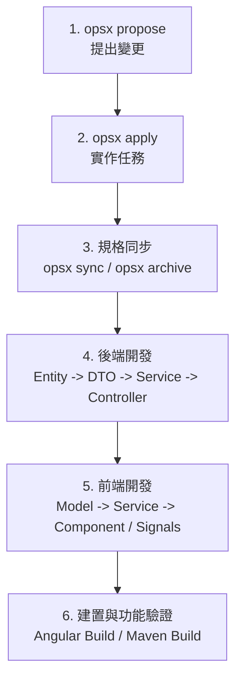

# AGENTS.md — 冒險紀錄表 Web版 專案 Agent 指引

歡迎來到 **冒險紀錄表 Web版 (dnd-adventure-log)** 專案！本檔案為 AI Agent 提供本專案的高階指引與工作原則。

---

## 🧭 專案核心文件索引

在進行任何工作之前，請先參閱以下核心文檔：

| 檔案 | 說明 |
|---|---|
| [`system-requirements-spec.md`](system-requirements-spec.md) | **系統需求規格書 (SRS)**（欄位定義、業務規則、UI/UX 行為） |
| [`database-schema.md`](database-schema.md) | **資料庫綱要與 Migration SQL**（Supabase PostgreSQL 表結構與歷次 ALTER 語句） |
| 本檔案下方的 Feature SOP | **公開開發規範**；本機 `.agents/` 額外規則若存在可參考，但不作為公開文件的必要依賴 |

### 公開版本庫與 Git 安全

- 未經使用者明確授權，不執行 commit、push 或歷史重寫；提交訊息以繁體中文為主。
- 不將實際帳密、密碼雜湊、私鑰、存取 Token、資料庫備份或私人操作紀錄寫入公開文件與測試資料。
- 範例使用環境變數或 `example.invalid`；OAuth Client ID、Secret 變數名稱與部署架構可公開，Secret 值不可公開。
- 發現外洩時先更換憑證；刪除目前檔案不代表 Git 歷史已清理。已套用 migration 的清理程序見 [維運說明](docs/public-repository-cleanup.md)。

### OpenSpec 目錄

本專案使用 **OpenSpec** 進行功能規劃與任務追蹤，所有進行中與已完成的變更均記錄於：

| 路徑 | 說明 |
|---|---|
| [`openspec/changes/`](openspec/changes/) | 各 change 的設計、規格 delta、任務清單 |
| [`openspec/changes/archive/`](openspec/changes/archive/) | 已完成並封存的 change |
| [`openspec/specs/`](openspec/specs/) | 主規格（由 openspec sync 更新） |
| [`openspec/config.yaml`](openspec/config.yaml) | OpenSpec 設定 |

> **提示**：需要了解目前任務狀態，請讀取進行中 change 下的 `tasks.md`；需要了解規格全貌，請讀取 `openspec/specs/` 或 `system-requirements-spec.md`。

---

## 🛠️ 開發與建置指令

### 前端 (Angular 22)
```bash
# 工作目錄: frontend/
cd frontend
npm install       # 安裝依賴
npm start         # 啟動開發伺服器 (http://localhost:4200)
npm run build     # Production 建置驗證
```

### 後端 (Spring Boot 4 / Java 17)
```bash
# 工作目錄: backend/
cd backend
./mvnw spring-boot:run              # 本機啟動 (http://localhost:8080)
./mvnw clean package -DskipTests    # 打包驗證 (產生 target/*.jar)
```

---

## 🚀 部署架構

| 層級 | 平台 | 觸發方式 |
|---|---|---|
| **前端** | Firebase Hosting | push `main` 且 `frontend/**` 有變更 → GitHub Actions 自動部署 |
| **後端** | GCP Cloud Run (`asia-east1`) | GCP Cloud Build Trigger 監聽 `main` → Build → Push 至 Artifact Registry → Deploy |

### 前端（GitHub Actions）
設定檔：[`.github/workflows/deploy-frontend.yml`](.github/workflows/deploy-frontend.yml)
- Node 22 build → `npm run build` → `firebase-tools deploy --only hosting`
- 所需 Secret：`FIREBASE_TOKEN`

### 後端（GCP Cloud Build）
設定檔：由 GCP Console Cloud Build Trigger 管理（**不存入 repo**，內含 Project ID 等基礎設施資訊）
- Docker build → push 至 Artifact Registry (`asia-east1`) → `gcloud run services update` 至 Cloud Run
- 變數由 GCP Cloud Build Trigger 設定，無需手動傳入

> **⚠️ Agent 注意**：部署由 CI/CD 自動觸發，**不需要也不應該手動執行部署指令**。確認需要部署時，請引導使用者 push 至 `main`，或在 GCP Console / GitHub Actions 手動觸發 workflow。

---

## 🔄 端到端功能開發標準流程 (Feature SOP)

當要新增或調整一個業務功能時，請遵循以下步驟：



1. **OpenSpec 先行**：用 `opsx propose` 提出變更，`opsx apply` 追蹤實作任務。
2. **規格同步**：完成後用 `opsx sync` 更新主規格，或 `opsx archive` 封存 change。
3. **資料庫層**：提供冪等性的 Migration SQL（`IF NOT EXISTS` / `ADD COLUMN IF NOT EXISTS`）。
4. **後端層**：
   - Entity 與 JPA Mapping。
   - Request / Response DTO（禁止 Controller 暴露 Entity）。
   - Service 商業邏輯運算與交易處理（`@Transactional`）。
   - Controller 路由與參數校驗。
5. **前端層**：
   - TypeScript Model 定義更新。
   - Service API 串接。
   - Standalone Component 視圖與 Signals (`signal()`, `computed()`) 即時響應。
6. **交付**：驗證編譯無誤，更新 change 的 `tasks.md` 任務狀態。
